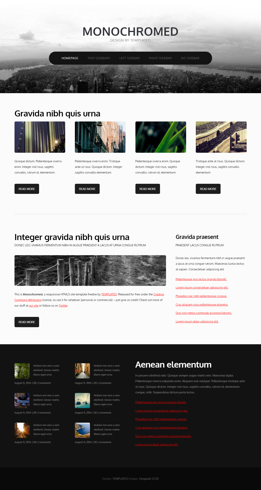
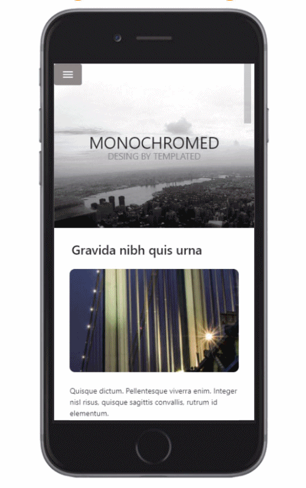
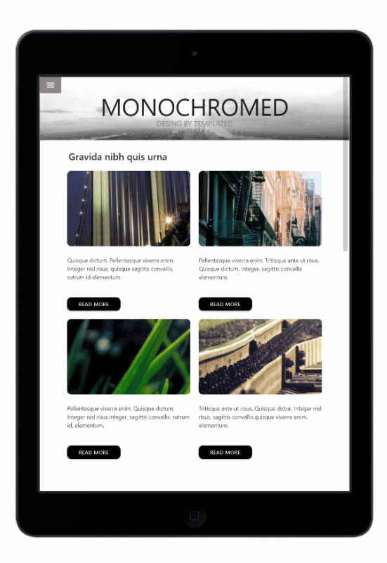
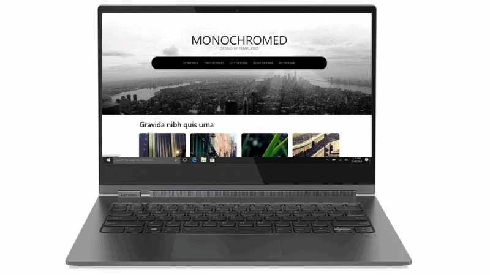

**Layout-practice-implementation**
It is a only layout project, made with html and css, fully responsive, initially done in Mobile first, and then in devices such as tablet and desktop.

The design that was followed to make pixel-perfect was the following:

  

 

 __IF YOU WANT TO SEE HOW THE APP WORKS ENTER THIS LINK:__ 
 
https://dianyelamaldonado.github.io/-Layout-practice-implementation/src/
 

|  **Tools and technologies used in the app**| 
| :-------------: |
| HTML |
| CSS |
|Materialize|
|Git & Github|

This is how the design was developed in the different devices:

 

  

  

 

___

 
**Layout-practice-implementation**
Es un proyecto únicamente de maquetación, realizado con html, y css, totalmente responsive, hecho inicialmente en Mobile first, y seguidamente en dispositivos como tablet y desktop.

El diseño que se siguió para hacer pixel-perfect fue el siguiente:

  

  

 __SI  QUIERES VER CÓMO FUNCIONA LA APP ENTRA A ESTE LINK:__ 
 
https://dianyelamaldonado.github.io/-Layout-practice-implementation/src/
 

|  **Herramientas y tecnologías usadas en la app**| 
| :-------------: |
| HTML |
| CSS |
|Materialize|
|Git & Github|

Así quedó desarrollado el diseño en los diferentes dispositivos:

 

  

  

 

